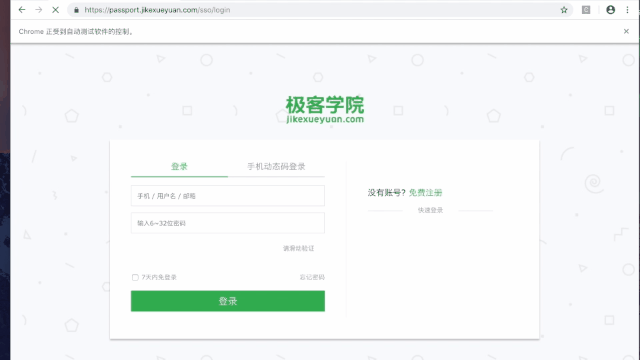

### 极客学院登录页面验证码破解
极客学院的登录页面是由简单的滑动验证码和图片验证码组合的形式，破解的步骤：
1. 输入账号的信息
2. 在页面上找到滑动验证码的宽度值
3. 找到滑动验证码的按钮，拖动的距离就是在页面上找到的滑动的距离，注意要控制滑动的速度，特别是在末尾的时候速度要慢一点
4. 滑动验证码通过后会出现一个图片验证码，这个页面上的图片验证码的数据不是url而是一个经过bas64加密的图片的数据，我们通过获取这个加密的数据，使用base64进行解码操作就可以得到图片
5. 然后将图片通过云打码平台帮助我们识别验证码字符
6. 将验证码字符写入页面的框中  完成验证

**动图演示**

